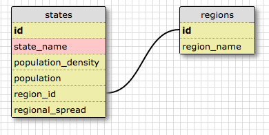

[Week 7 Home](../)

# U3.W7: Introduction to Databases

## Learning Competencies
-
-
-

## Summary
You have been building programs that need to store data. Up to this point you have been storing data in data structures, probably in either `array`s or `hash`es. In reality, most applications do not store data this way. Imagine Facebook storing its users' information in one data structure. It would be massive, difficult to navigate, and the site would take a really long time to load. Instead, information is often stored in a database. Depending on the data you want to collect and use and its relationship to one another, databases can get pretty complex. In this challenge, you will learn a bit about databases and a one-to-many relationship.

## Releases

## Release 0: Introduction to Databases
If this is your first time working with databases, you will probably want to look through a couple of these resources.
- [VIDEO: Database Basics](https://www.youtube.com/watch?v=oxuy4AP860g)
- [VIDEO: Databases and SQL - an introduction](http://www.youtube.com/watch?v=SVV7HjKmFY4)
- [VIDEO: Database Fundamentals](http://www.youtube.com/watch?v=xNJZYX6tpWU)
- [VIDEO: Relational Database Concepts](https://www.youtube.com/watch?v=NvrpuBAMddw)
- [READING: Relational Database Design](http://www.ntu.edu.sg/home/ehchua/programming/sql/Relational_Database_Design.html)

## Release 1: One to Many Relationships
Do you remember the giant hashy hash from the VirusPredictor challenge? In reality, most programs do not store information in a giant hash, array, or other data structure. Data is most often stored in a Database. For example, if the data from the `STATE_DATA` hash was stored a Database, it would look something like:

Table Name: states

id | state_name | population_density | population | region_id
---|------|--------------------|------------|--------
1 | Alabama| 96.45 | 4822023 | 5|
2 | Alaska | 1.1111 | 731449 | 10
3 | Arizona| 57.05| 6553255 | 8
4 | Arkansas | 56.43| 2949131 | 7
5 | California | 244.2| 38041430 | 9
6 | Colorado | 49.33| 5187582 | 8
7 | Connecticut | 741.4| 3590347 | 1
8 | Delaware | 470.7| 917092 | 3
9 | Florida | 360.2| 19317568 | 3
10 | Georgia | 172.5| 9919945 | 3
11 | Hawaii | 216.8| 1392313 | 11
12 | Idaho | 19.15| 1595728 | 8
13 | Illinois | 231.9| 12875255 | 4
14 | Indiana | 182.5| 6537334 | 4
15 | Iowa | 54.81| 3074186 | 6
16 | Kansas | 35.09| 2885905 | 6
17 | Kentucky | 110.0| 4380415 | 5
18 | Louisiana | 105.0| 4601893 | 7
19 | Maine | 43.04| 1329192 | 1
20 | Maryland | 606.2| 5884563 | 3
21 | Massachusetts | 852.1| 6646144 | 1
22 | Michigan | 174.8| 9883360 | 4
23 | Minnesota | 67.14| 5379139 | 6
24 | Mississippi | 63.50| 2984926 | 5
25 | Missouri | 87.26| 6021988 | 6
26 | Montana | 6.86| 1005141 | 8
27 | Nebraska | 23.97| 1855525 | 6
28 | Nevada | 24.8| 2758931 | 8
29 | New Hampshire | 147.0| 1320718 | 1
30 | New Jersey | 1205| 8864590 | 2
31 | New Mexico | 17.16| 2085538 | 8
32 | New York | 415.3| 19570261 | 2
33 | North Carolina | 200.6| 9752073 | 3
34 | North Dakota | 9.92| 699628 | 6
35 | Ohio | 282.5| 11544225 | 4
36 | Oklahoma | 55.22| 3814820 | 7
37 | Oregon | 40.33| 3899353 | 9
38 | Pennsylvania | 285.3| 12763536 | 2
39 | Rhode Island | 1016| 1050292 | 1
40 | South Carolina | 157.1| 4723723 | 3
41 | South Dakota | 10.86| 833354 | 6
42 | Tennessee | 156.6| 6456243 | 5
43 | Texas | 98.07| 26059203 | 7
44 | Utah | 34.3| 2855287 | 8
45 | Vermont | 67.73| 626011 | 1
46 | Virginia | 207.3| 8185867 | 3
47 | Washington | 102.6| 6724540 | 9
48 | Washington,D.C.| 10357| 632323 | 3
49 | West Virginia | 77.06| 1855413 | 3
50 | Wisconsin | 105.2| 5726398 | 4
51 | Wyoming | 5.851| 576412 | 8

This is one table in a database. If you look at the data, you'll see a section for `region_id`. This was called `region` in the original challenge. So the `states` table is storing a relationship. States belong to a region. A region has many states. This is called a one-to-many relationship. You can identify a one-to-many relationship using the phrases "____ belongs to a ____.  ____ has many ____."

The regions table would look like this:

Table Name: regions

id | region_name |
---|-------------
1  | New England |
2  | Mid-Atlantic |
3  | South Atlantic |
4  | East North Central |
5  | East South Central |
6  | West North Central |
7  | West South Central |
8  | Mountain |
9  | Pacific |
10 | North Pacific |
11 | Tropical Pacific |

As you can see, the region is referred to by its `id` in the `states` table rather than by its name. That is because it is faster for the computer to search for numbers rather than strings.

Release 2: Schema Design
When designing a database, it is a good idea to draw out a design where you identify the table and field (column) names.

For the VirusPredictor example, the two tables would be represented like this:

<pre>
+--------------------+        +-------------+
| states             |        | region      |
+--------------------+        +-------------+
| id                 |      --| id          |
| state_name         |    /   | region_name |
| population_density |   /    +-------------+
| population         |  /
| region_id          |--
+--------------------+
</pre>

You can use a design tool like like [SQL Designer](https://socrates.devbootcamp.com/sql) to draw your schema.
These tools as you to specify data types, which were not captured in the table above. In the image below, the yellow fields represent numeric values and the red fields represent text values.

As you can see, there is a line connecting the `id` field from the `regions` table to the `region_id` field from the `states` table. This line shows that the two tables are connected by those fields, thus the two numbers should be the same. For Example, if you look at New York, you can see the `region_id` is 2, which means New York belongs to the Mid-Atlantic region.

**NOTE:** In [SQL Designer](https://socrates.devbootcamp.com/sql), you'll notice that you can pick a "type" for each field.  For example, the birthday field should be a "date" type.  There's a core set of datatypes that all SQL-based databases support, but many have additional types. You can read more about that at [w3schools.com](http://www.w3schools.com/sql/sql_datatypes.asp) or on [Wikipedia](http://en.wikipedia.org/wiki/SQL#Data_types). For now, don't worry about using the perfect datatype (i.e. `varchar` vs. `text`), just use the one that colors it appropriately. SQL Designer is a bit weird to use. You have to use the menu at the right and then play with it a bit. You'll get the hang of it soon!

## Release 3: Basic SELECT statements
Now that you know a bit about the database, and you already know its contents, it's time to use SQL to query the information.

Before you can do that, you'll want to navigate to this directory in your terminal and type `sqlite3 state_region.sqlite3`. This will put you into a SQLite shell where you can experiment with SQL commands. You can see the schema for the database by calling `.schema`. You can quit by typing `.exit`.

You'll want to look up commands for each of the challenges using the [SQL Tutorial on w3schools.com](http://www.w3schools.com/sql/). Once you find the correct SQL query (the correct code that returns what it should return), you'll need to add the proper commands to your [my_solution.sql](my_solution.sql) file.

If you want to see what the correct output looks like for each, you can look at the [answers.md](answers.md) file. NOTE: some of the state names are cut off in the answers. Don't worry about that.

Create SQL Queries for the following:

1. Select all data for all states
2. Select all data for the regions
3. Select the `state_name` and `population` for all states.
4. Select the `state_name` and `population` for all states ordered by population. The most populous state should be at the top.
5. Select the `state_names` for the states in region 7.
6. Select the `state_names` and `population_density` with a population density over 50 ordered from least to most dense.
7. Select all `state_names` for states with a population between 1 million and 1.5 million people.
8. Select all `state_names` and `region_id` ordered by region in ascending order.
9. Select the `region_name` for the regions with "Central" in the name.
10. Select all of the `region_name`s and the `state_name`s in ascending order by `region_id`. Refer to the region by name. (This will involve joining the tables).

## Release 2: One to Many Schema

## Release 3:

## Release 4:

## Release 5:

## Release 6: [Reflect](https://github.com/Devbootcamp/phase-0-handbook/blob/master/coding-references/reflection-guidelines.md)
in the reflection section of your [my_solution.md](my_solution.md) file.

## Release 7: