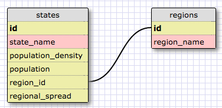

[Week 8 Home](../)

# U3.W8: Introduction to Databases

## Learning Competencies
- Identify a one-to-many relationship
- Create SQL queries to access data in a database
- Design a one-to-many schema

## Summary
You have been building programs that need to store data. Up to this point you have been storing data in data structures, probably in either `array`s or `hash`es. In reality, most applications do not store data this way. Imagine Facebook storing its users' information in one data structure. It would be massive, difficult to navigate, and the site would take a really long time to load. Instead, information is often stored in a database. Depending on the data you want to collect and use and its relationship to one another, databases can get pretty complex. In this challenge, you will learn a bit about databases and a one-to-many relationship.

## Releases

## Release 0: Introduction to Databases
If this is your first time working with databases, you will probably want to look through a couple of these resources.
- [VIDEO: Database Basics](https://www.youtube.com/watch?v=oxuy4AP860g)
- [VIDEO: Databases and SQL - an introduction](http://www.youtube.com/watch?v=SVV7HjKmFY4)
- [VIDEO: Database Fundamentals](http://www.youtube.com/watch?v=xNJZYX6tpWU)
- [VIDEO: Relational Database Concepts](https://www.youtube.com/watch?v=NvrpuBAMddw)
- [READING: Relational Database Design](http://www.ntu.edu.sg/home/ehchua/programming/sql/Relational_Database_Design.html)

## Release 1: One to Many Relationships
Do you remember the giant hashy hash from the VirusPredictor challenge? This is a perfect example of data better stored in a database. If the data from the `STATE_DATA` was stored in a table, it would look something like:

**Table Name: states**

id | state_name | population_density | population | region_id
---|------|--------------------|------------|--------
1 | Alabama| 96.45 | 4822023 | 5|
2 | Alaska | 1.1111 | 731449 | 10
3 | Arizona| 57.05| 6553255 | 8
..|........|......|........|..
50 | Wisconsin | 105.2| 5726398 | 4
51 | Wyoming | 5.851| 576412 | 8

This is one table in a database. If you look at the data, you'll see a section for `region_id`. This was called `region` in the original challenge. So the `states` table is storing a relationship. States belong to a region. A region has many states. This is called a one-to-many relationship. You can identify a one-to-many relationship using the phrases "____ belongs to a ____.  ____ has many ____." For example, Wisconsin only belongs to the East North Central Region. The East North Central Region has many states.

The regions table would look like this:

**Table Name: regions**

id | region_name |
---|-------------
1  | New England |
2  | Mid-Atlantic |
3  | South Atlantic |
4  | East North Central |
5  | East South Central |
6  | West North Central |
7  | West South Central |
8  | Mountain |
9  | Pacific |
10 | North Pacific |
11 | Tropical Pacific |

As you can see, the region is referred to by its `id` in the `states` table rather than by its name. That is because it is faster for the computer to search for numbers rather than strings.

## Release 2: Schema Design
When designing a database, it is a good idea to draw out a design where you identify the table and field (column) names.

For the VirusPredictor example, the two tables would be represented like this:

<pre>
+--------------------+        +-------------+
| states             |        | region      |
+--------------------+        +-------------+
| id                 |      --| id          |
| state_name         |    /   | region_name |
| population_density |   /    +-------------+
| population         |  /
| region_id          |--
+--------------------+
</pre>

You can use a design tool like [SQL Designer](https://socrates.devbootcamp.com/sql) to draw your schema.
These tools ask you to specify data types, which were not captured in the table above. In the image below, the yellow fields represent numeric values and the red fields represent text values.

As you can see, there is a line connecting the `id` field from the `regions` table to the `region_id` field from the `states` table. This line shows that the two tables are connected by those fields, thus the two numbers should be the same. For example, if you look at Arizona, you can see the `region_id` is 8, which means Arizona belongs to the Mountain region.

**NOTE:** In [SQL Designer](https://socrates.devbootcamp.com/sql), you'll notice that you can pick a "type" for each field.  For example, the birthday field should be a "date" type.  There's a core set of datatypes that all SQL-based databases support, but many have additional types. You can read more about that at [w3schools.com](http://www.w3schools.com/sql/sql_datatypes.asp) or on [Wikipedia](http://en.wikipedia.org/wiki/SQL#Data_types). For now, don't worry about using the perfect datatype (i.e. `varchar` vs. `text`), just use the one that colors it appropriately. SQL Designer is a bit weird to use. You have to use the menu at the right and then play with it a bit. You'll get the hang of it soon!

## Release 3: SELECT statements
Now that you know a bit about the database, and you already know its contents, it's time to use SQL to query the information.

Before you can do that, you'll want to navigate to this directory in your terminal and type `sqlite3 state_region.sqlite3`. This will put you into a SQLite shell where you can experiment with SQL commands. You can see the schema for the database by calling `.schema`. You can quit by typing `.exit`.

You'll want to look up commands for each of the challenges using the [SQL Tutorial on w3schools.com](http://www.w3schools.com/sql/). Once you find the correct SQL query (the correct code that returns what it should return), you'll need to add the proper commands to your [my_solution.md](my_solution.md) file. The correct output is shown in the [my_solution.md](my_solution.md) file. Don't worry if the names of states and regions are cut off.

Create SQL Queries for the following:

1. Select all data for all states
2. Select all data for the regions
3. Select the `state_name` and `population` for all states.
4. Select the `state_name` and `population` for all states ordered by population. The most populous state should be at the top.
5. Select the `state_names` for the states in region 7.
6. Select the `state_names` and `population_density` with a population density over 50 ordered from least to most dense.
7. Select all `state_names` for states with a population between 1 million and 1.5 million people.
8. Select all `state_names` and `region_id` ordered by region in ascending order.
9. Select the `region_name` for the regions with "Central" in the name.
10. Select all of the `region_name`s and the `state_name`s in ascending order by `region_id`. Refer to the region by name. (This will involve joining the tables).

## Release 4: One-to-Many Schema

In the 1995 Teen Comedy *Clueless*, Cher (the main character) had a lot of outfits, and an entire software program to help her create them. Make a simple schema design in [SQL Designer](https://socrates.devbootcamp.com/sql) to include `persons` and `outfits` tables. Create at least 4 fields (with general types**) for each table. One of the fields in the `persons` table should refer to the `id` in the `outfits` table. You may want to reference the [conventions.md](conventions.md) file to read about database naming conventions.

When you finish, take a screen shot of your schema design, upload it into the imgs directory and include it inline in your [my_solution.md](my_solution.md) file.

** For types, just select the type that creates the right color. It doesn't matter right now whether you select between TEXT or VARCHAR for example. As long as it's yellow you're ok.

## Release 6: [Reflect](https://github.com/Devbootcamp/phase-0-handbook/blob/master/coding-references/reflection-guidelines.md)
in the reflection section of your [my_solution.md](my_solution.md) file.

## Release 7: [Review](https://github.com/Devbootcamp/phase-0-handbook/blob/master/coding-references/review.md) (Optional)
**Optional but HIGHLY encouraged!**
