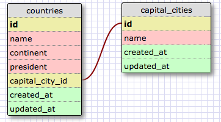
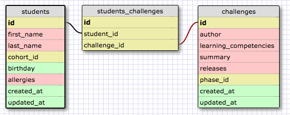

[Week 8 Home](../)

# U3.W8: More Schemas

## Learning Competencies
- Identify one-to-one and many-to-many relationships
- Design schemas for one-to-one and many-to-many relationships

## Summary
As you might guess, there are other types of relationships in relational databases (like SQL) other than one-to-many. There are also one-to-one and many-to-many relationships as well. These can be a bit more confusing to understand and may require you to do some googling to get a feel for.

## Releases

## Release 0: One to One Relationships
One-to-one relationships are used when two things have a single relationship to one another. Essentially, they are a pair.  One example is a country and its capital. A country has a capital city, and the capital city is only in one country. If this were drawn into a schema, it could look something like this:

This design demonstrates a one-to-one relationship because a country can have at most one capital city. The capital city does not need to have a field for its country id. Using SQL, it would be easy to query the country a capital city belonged to based on this schema.

One-to-one relationships are especially difficult to understand because it's difficult to see when you would use one. For example,  you could create a field for a `capital_city_name` in the `countries` table rather than making a separate table for `capital_cities`.

The general rule of thumb is to use a one-to-one relationship if you have a relationship where a group of fields (relating to something like `captial_cities`) can all optionally be empty (signified by `NULL`). For another example, watch [this video](https://www.youtube.com/watch?v=a0Ov6TGhpyI) for another example of why you would use it. (Pardon the technical difficulties).

For the example above, all countries now have capital cities, but prior to the late-eighteenth/ early-nineteenth centuries, many countries (or places where a group of similar people lived) did not have a capital city. So it would be possible to have a lot of information about the country, and have `NULL` for any `capital_city_name` field.

## Release 1: Your One-to-one Schema
Create your own one-to-one schema using [SQL Designer](https://socrates.devbootcamp.com/sql). Create your own example. Each table should have at least four fields. When you finish your schema, take a screen shot, upload it to the imgs directory in this challenge, and display it inline in your [my_solution.md](my_solution.md) file.

## Release 2: Many to Many Relationships
Many-to-many relationships are common and relatively easy to understand.

For example, consider `students` and `challenges`. A challenge is solved by many students, and students have many challenges. (Other examples of this are instructors and courses - instructors teach many courses and courses are taught by various instructors).

To model a many-to-many relationship, two distinct tables are connected by a **join table**. A join table connects the two independent tables by keeping track of the two `id`s.

Other information can be added to a join table that is specific to that instance when the two tables connected (like when the challenge was started or completed) which creates a more complicated schema.

## Release 3: GroceryList
Remember the GroceryList challenge? A `GroceryList` has many `Items`. `Items` can belong to many different `GroceryList`s. (Remember that Ruby classes use CamelCase whereas table names use snake_case).

Model the relationship between `grocery_lists` and `items` using [SQL Designer](https://socrates.devbootcamp.com/sql). Each table should have at least four fields in each. You should also model the join table. When you finish your schema, take a screen shot, upload it to the imgs directory in this challenge, and display it inline in your [my_solution.md](my_solution.md) file.

## Release 4: [Reflect](https://github.com/Devbootcamp/phase-0-handbook/blob/master/coding-references/reflection-guidelines.md)
Reflect on your process and learning in the [my_solution.md](my_solution.md) file.

## Release 5: [Review](https://github.com/Devbootcamp/phase-0-handbook/blob/master/coding-references/review.md) (Optional)
**Optional but HIGHLY encouraged!**
