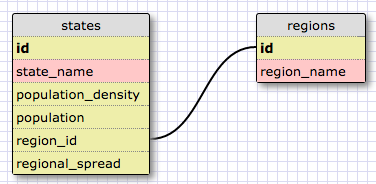
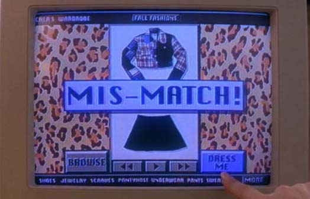

[Week 8 Home](../)

# U3.W8: Introduction to Databases

## Learning Competencies
- Identify a one-to-many relationship
- Create SQL queries to access data in a database
- Design a one-to-many schema

## Summary
You have been building programs that need to store data. Up to this point you have been storing data in data structures, probably in either `array`s or `hash`es. In reality, most applications do not store data this way. Imagine Facebook storing its users' information in one data structure. It would be massive, difficult to navigate, and the site would take a really long time to load. Instead, information is often stored in a database. Depending on the data you want to collect and use and its relationship to one another, databases can get pretty complex. In this challenge, you will learn a bit about databases and a one-to-many relationship.

## Releases

## Release 0: Introduction to Databases
Select one or two of these resources to get introduced to databases then work through the challenge. If you have some experience with SQL or databases, you may just want to research and find your own refresher. If you need more information you think you can get from the videos, return to them.

- [VIDEO: Database Basics](https://www.youtube.com/watch?v=oxuy4AP860g)
- [VIDEO: Databases and SQL - an introduction](http://www.youtube.com/watch?v=SVV7HjKmFY4)
- [VIDEO: Database Fundamentals](http://www.youtube.com/watch?v=xNJZYX6tpWU)
- [VIDEO: Relational Database Concepts](https://www.youtube.com/watch?v=NvrpuBAMddw)
- [Stanford VIDEO Course: Databases](https://www.youtube.com/channel/UC5ZAemhQUQuNqW3c9Jkw8ug/videoshttps%3A//class.stanford.edu/courses/Home/Databases/Engineering/about)
- [READING: Relational Database Design](http://www.ntu.edu.sg/home/ehchua/programming/sql/Relational_Database_Design.html)

## Release 1: One to Many Relationships
Do you remember the giant "hashy hash" from the VirusPredictor challenge? This is a perfect example of data better stored in a database. If the data from the `STATE_DATA` was stored in a table, it would look something like:

id | state_name | population_density | population | region_name | region_id
---|------|--------------------|------------|--------|-------
1 | Alabama| 96.45 | 4822023 | East South Central | 5
2 | Alaska | 1.1111 | 731449 | North Pacific | 10
3 | Arizona| 57.05| 6553255 | Mountain |8
..|........|......|........|.......|..
50 | Wisconsin | 105.2| 5726398 | East North Central | 4
51 | Wyoming | 5.851| 576412 | Mountain | 8

This certainly appears more intuitive and descriptive, but if you look closely there is some repetition. It would be really annoying, for instance, to have to type in the same region name every time you enter a new state, not to mention open to the possibility of making simple typing errors. When designing databases, it's important to minimize the amount of space used and avoid repetition.

Since this isn't very DRY, how can it be fixed? Well, regions and states are fundamentally different things with a relationship. States belong to a region, and regions have many states. This is called a **one-to-many relationship**. You can identify a one-to-many relationship using the phrases "____ belongs to a ____.  ____ has many ____." For example, Wisconsin only belongs to the East North Central Region. The East North Central Region has many states. Because these two things have a one-to-many relationship, it makes far more sense to separate them into two tables.

## Release 2:
If the first table were separated into two tables, they would look like this:

**Table Name: states**

id | state_name | population_density | population | region_id
---|------|--------------------|------------|--------
1 | Alabama| 96.45 | 4822023 | 5
2 | Alaska | 1.1111 | 731449 | 10
3 | Arizona| 57.05| 6553255 | 8
..|........|......|........|..
50 | Wisconsin | 105.2| 5726398 | 4
51 | Wyoming | 5.851| 576412 | 8

**Table Name: regions**

id | region_name |
---|-------------
1  | New England
2  | Mid-Atlantic
3  | South Atlantic
4  | East North Central
5  | East South Central
6  | West North Central
7  | West South Central
8  | Mountain
9  | Pacific
10 | North Pacific
11 | Tropical Pacific

As you can see, the region is referred to by its `id` in the `states` table rather than by its name. That is because it is faster for the computer to search for numbers rather than strings.

## Release 3: Schema Design
When designing a database, it is a good idea to draw out a design where you identify the table and field (column) names.

For the VirusPredictor example, the two tables would be represented like this:

<pre>
+--------------------+        +-------------+
| states             |        | regions     |
+--------------------+        +-------------+
| id                 |      --| id          |
| state_name         |    /   | region_name |
| population_density |   /    +-------------+
| population         |  /
| region_id          |--
+--------------------+
</pre>

You can use a design tool like [SQL Designer](https://socrates.devbootcamp.com/sql) to draw your schema.

This tool requires you to specify a data type for each field and color codes it accordingly. In the image below, the yellow fields represent numeric values and the red fields represent text values.



As you can see, there is a line connecting the `id` field from the `regions` table to the `region_id` field from the `states` table. This line shows that the two tables are connected by those fields, thus the two numbers should be the same. For example, if you look at Arizona, you can see the `region_id` is 8, which means Arizona belongs to the Mountain region.

**NOTE:** In [SQL Designer](https://socrates.devbootcamp.com/sql), you'll notice that you can pick a "type" for each field.  For example, the birthday field should be a "date" type.  There's a core set of data types that all SQL-based databases support, but many have additional types. You can read more about that at [w3schools.com](http://www.w3schools.com/sql/sql_datatypes.asp) or on [Wikipedia](http://en.wikipedia.org/wiki/SQL#Data_types). For now, don't worry about using the perfect data type (i.e. `varchar` vs. `text`), just use the one that colors it appropriately.

SQL Designer is a bit weird to use. You have to use the menu at the right and then play with it a bit. Here's what you can do to get started. First click on "Add Table" then click anywhere on the graph "paper." To add fields, click on the table and then "add field." To connect tables, click on the `id` of the first table, and then click on "connect foreign key." Then click on the field in the other table you want to connect it to.

## Release 4: SELECT statements
Now that you know a bit about the database and its contents, it's time to use SQL to query the information.

Navigate to this directory in your terminal and type the following: (if you are not using Windows):

```shell
cat << EOF > ~/.sqliterc
.headers on
.mode column
EOF
```

Now type `sqlite3 state_region.sqlite3`. (This will open up the file using a SQLite shell) You will be able to experiment with SQL commands in the SQLite shell. View the schema for the database by calling `.schema`. You can quit the SQL shell by typing `.exit`.

If you are using Windows, use the [SQLite documentation](https://www.sqlite.org/cli.html) to turn on headers and set the mode (seen in the code above) once you've opened the file.

Go through each of the queries below in the SQLite shell. If your command works properly, it should display and match the answer in the my_solution.md file.

You'll want to look up commands for each of the challenges using the [SQL Tutorial on w3schools.com](http://www.w3schools.com/sql/). Once you find the correct SQL query (the correct code that returns what it should return), you'll need to add the proper commands to your [my_solution.md](my_solution.md) file. The correct output is shown in the [my_solution.md](my_solution.md) file. Don't worry if the names of states and regions are cut off.

Create SQL Queries for the following:
(Make sure all queries end with a semi-colon, if you forget, just enter it on the next line.)

1. Select all data for all states.
2. Select all data for all regions.
3. Select the `state_name` and `population` for all states.
4. Select the `state_name` and `population` for all states ordered by population. The most populous state should be at the top.
5. Select the `state_name` for the states in region 7.
6. Select the `state_name` and `population_density` for states with a population density over 50 ordered from least to most dense.
7. Select the `state_name` for states with a population between 1 million and 1.5 million people.
8. Select the `state_name` and `region_id` for states ordered by region in ascending order.
9. Select the `region_name` for the regions with "Central" in the name.
10. Select the `region_name` and the `state_name` for all states and regions in ascending order by `region_id`. Refer to the region by name. (This will involve joining the tables).

## Release 5: One-to-Many Schema




In the 1995 Teen Comedy *Clueless*, Cher (the main character) had a lot of outfits, and an entire software program to help her decide what to wear. Make a simple schema design in [SQL Designer](https://socrates.devbootcamp.com/sql) to include `persons` and `outfits` tables. Create at least 4 fields (with general types**) for each table. One of the fields in the `outfits` table should refer to the `id` in the `persons` table. You should reference the [conventions.md](conventions.md) file to read about database naming conventions.

When you finish, take a screen shot of your schema design, upload it into the imgs directory and include it inline in your [my_solution.md](my_solution.md) file.

** For types, just select the type that creates the right color. It doesn't matter right now whether you select between TEXT or VARCHAR for example. As long as it's red you're okay.

## Release 6: [Reflect](https://github.com/Devbootcamp/phase-0-handbook/blob/master/coding-references/reflection-guidelines.md)
Reflect on your process and learning in the [my_solution.md](my_solution.md) file.

## Release 7: [Review](https://github.com/Devbootcamp/phase-0-handbook/blob/master/coding-references/review.md) (Optional)
**Optional but HIGHLY encouraged!**
