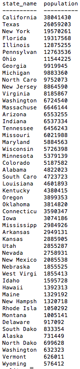

# U3.W8: Introduction to Databases

#### I worked on this challenge [by myself, with: ]
#### This challenge took me [#] hours.

## Release 4: SQL Queries

Paste the correct SQL queries for each of the following challenges below. There is a screen shot associated with each challenge. You should make sure your query matches the screen shot before moving on.

###1. Select all data for all states.  
  

  **SQL Query:**

###2. Select all data for the regions.  
  

  **SQL Query:**

###3. Select the `state_name` and `population` for all states.  
  

  **SQL Query:**

###4. Select the `state_name` and `population` for all states ordered by population. The most populous state should be at the top.  
  

  **SQL Query:**

###5. Select the 'state_name's for the states in region 7.  
  

  **SQL Query:**

###6. Select the 'state_names' and 'population_density' with a population density over 50 ordered from least to most dense.  
  

  **SQL Query:**

###7. Select all state_names for states with a population between 1 million and 1.5 million people.  
  

  **SQL Query:**

###8. Select all state_names and region_id ordered by region in ascending order.  
  

  **SQL Query:**

###9. Select the 'region_name' for the regions with "Central" in the name.  
  

  **SQL Query:**

###10. Select all of the region names and the state names in ascending order by regional id. Refer to the region by name. (This will involve joining the tables).  
  

  **SQL Query:**

## Release 5: `persons` and `outfits` Schema
<!-- Include a link to your schema design here -->

## Release 6: Reflection
