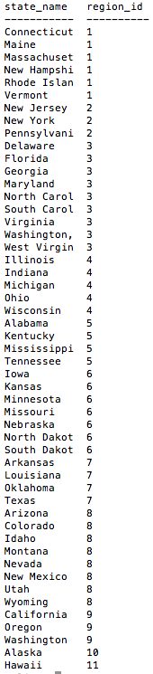

# U3.W8: Introduction to Databases

#### I worked on this challenge by myself.
#### This challenge took me [#] hours.

## Release 4: SQL Queries

Paste the correct SQL queries for each of the following challenges below. There is a screen shot associated with each challenge. You should make sure your query matches the screen shot before moving on.

###1. Select all data for all states.  
  

  **SQL Query:select * from states;**

###2. Select all data for the regions.  
  

  **SQL Query:select * from regions;**

###3. Select the `state_name` and `population` for all states.  
  

  **SQL Query:select state_name,population from states;**

###4. Select the `state_name` and `population` for all states ordered by population. The most populous state should be at the top.  
  

  **SQL Query:select state_name,population from states order by population desc;**

###5. Select the 'state_name's for the states in region 7.  
  

  **SQL Query:select state_name from states where region_id = 7;**

###6. Select the 'state_names' and 'population_density' with a population density over 50 ordered from least to most dense.  
  

  **SQL Query:select state_names,population_desnity where population_desnity > 50 order by population_density asc;**

###7. Select all state_names for states with a population between 1 million and 1.5 million people.  
  

  **SQL Query: select state_name from states where population between 1000000 and 1500000;**

###8. Select all state_names and region_id ordered by region in ascending order.  
  

  **SQL Query: select state_name,region_id from states order by region_id asc;**

###9. Select the 'region_name' for the regions with "Central" in the name.  
  

  **SQL Query: select region_name from regions where region_name like '%Central%';**

###10. Select all of the region names and the state names in ascending order by regional id. Refer to the region by name. (This will involve joining the tables).  
  

  **SQL Query: select regions.region_name,states.state_name from states inner join regions on states.region_id = regions.id order by region_id asc;**

## Release 5: `persons` and `outfits` Schema
<!-- Include a link to your schema design here -->

## Release 6: Reflection
<!-- This challenge was pretty easy from the beginning but it got frustrating because the documentation did not clearly define what needs to be done. The frustration started with entering the sql stuff into the terminal. It did not clearly define what directory we are supposed to navigate to, I had to guess and check. Then the linking of tables wasn't straightforward so I had to dig online to figure out. I feel this challenge should've been a lot better if the documentation was clearer.-->